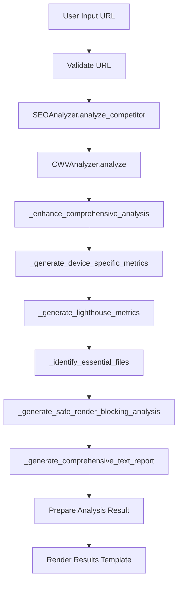

# Core Web Vitals Analysis - Technical Developer Guide

## 📋 Table of Contents
1. [Architecture Overview](#architecture-overview)
2. [Code Structure](#code-structure)
3. [Core Components](#core-components)
4. [Analysis Flow](#analysis-flow)
5. [Helper Functions](#helper-functions)
6. [Data Models](#data-models)
7. [Template System](#template-system)
8. [Error Handling](#error-handling)
9. [Performance Optimization](#performance-optimization)
10. [Testing Strategy](#testing-strategy)
11. [Extension Guide](#extension-guide)

## 🏗️ Architecture Overview

The Core Web Vitals Analysis system is built using a modular Flask Blueprint architecture that integrates seamlessly with the existing SEOAnalyzePro platform.

### System Architecture
```
┌─────────────────────────────────────────────────────────────┐
│                    SEOAnalyzePro Platform                   │
├─────────────────────────────────────────────────────────────┤
│  Flask Application (app.web.app)                           │
│  ├── Authentication Blueprint (auth_bp)                    │
│  ├── Routes Blueprint (routes_bp)                          │
│  ├── Users Blueprint (users_bp)                            │
│  ├── Competitors Blueprint (competitors_bp)                │
│  ├── Keyword Gap Blueprint (keyword_gap_bp)                │
│  ├── Keyword Gap v2 Blueprint (keyword_gap_v2_bp)          │
│  └── Core Web Vitals Blueprint (core_web_vitals_bp) ← NEW  │
└─────────────────────────────────────────────────────────────┘
```

### Core Web Vitals Blueprint Structure
```
core_web_vitals_bp/
├── Routes
│   ├── /core-web-vitals/ (GET) - Input form
│   └── /core-web-vitals/ (POST) - Analysis processing
├── Templates
│   ├── core_web_vitals.html - Input form template
│   └── core_web_vitals_result.html - Results template
├── Core Logic
│   ├── Main analysis function
│   ├── 50+ helper functions
│   └── Safety system
└── Integration
    ├── SEOAnalyzer integration
    ├── CWVAnalyzer integration
    └── Data export system
```

## 📁 Code Structure

### Main Blueprint File: `app/web/core_web_vitals.py`

#### File Organization
```python
# Imports and Blueprint Setup
from __future__ import annotations
from flask import Blueprint, render_template, request, flash, redirect, url_for
from .routes import login_required
import traceback
import json
import os
from datetime import datetime

core_web_vitals_bp = Blueprint("core_web_vitals", __name__, url_prefix="/core-web-vitals")

# Main Route Functions
@core_web_vitals_bp.route("/", methods=["GET", "POST"])
@login_required
def core_web_vitals_index():
    # Main analysis logic

# Helper Functions (50+ functions)
def _enhance_comprehensive_analysis():
    # Comprehensive analysis enhancement

def _generate_realistic_cwv_metrics():
    # Realistic CWV metrics generation

def _generate_device_specific_metrics():
    # Device-specific analysis

def _generate_lighthouse_metrics():
    # Lighthouse-style audit

def _identify_essential_files():
    # Essential files identification

def _generate_safe_render_blocking_analysis():
    # Safe render-blocking analysis

def _generate_comprehensive_text_report():
    # Comprehensive text report generation

# ... 40+ more helper functions
```

### Core Analyzer: `app/core/cwv_analyzer.py`

#### Data Models
```python
from dataclasses import dataclass
from typing import List, Optional, Dict, Any
from datetime import datetime

@dataclass
class CWVMetrics:
    """Core Web Vitals metrics"""
    lcp: Optional[float] = None  # Largest Contentful Paint (seconds)
    inp: Optional[float] = None  # Interaction to Next Paint (ms)
    cls: Optional[float] = None  # Cumulative Layout Shift
    fcp: Optional[float] = None  # First Contentful Paint (seconds)
    ttfb: Optional[float] = None  # Time to First Byte (seconds)
    tti: Optional[float] = None  # Time to Interactive (seconds)

@dataclass
class CWVReport:
    """Complete Core Web Vitals report"""
    url: str
    timestamp: str
    cwv_metrics: CWVMetrics
    overall_score: float
    grade: str
    priority_actions: List[Dict[str, str]]
    render_blocking: List[Dict[str, str]]
    image_optimization: Dict[str, Any]
    # ... other fields
```

## 🔧 Core Components

### 1. Main Analysis Function

#### `core_web_vitals_index()`
```python
@core_web_vitals_bp.route("/", methods=["GET", "POST"])
@login_required
def core_web_vitals_index():
    if request.method == "POST":
        try:
            website_url = request.form.get("url", "").strip()
            analysis_type = "comprehensive"  # Always use comprehensive
            
            # Validate URL
            if not website_url:
                flash("Please enter a website URL", "error")
                return render_template("core_web_vitals.html")
            
            # Get basic SEO data
            seo_analyzer = SEOAnalyzer()
            basic_data = seo_analyzer.analyze_competitor(website_url)
            
            # Generate Core Web Vitals report
            cwv_analyzer = CWVAnalyzer()
            cwv_report = cwv_analyzer.analyze(website_url, basic_data['soup'], basic_data.get('response_time', 0))
            
            # Enhance with comprehensive analysis
            cwv_report = _enhance_comprehensive_analysis(cwv_report, basic_data, website_url)
            
            # Generate additional metrics
            device_metrics = _generate_device_specific_metrics(basic_data['soup'], website_url)
            lighthouse_metrics = _generate_lighthouse_metrics(cwv_report, basic_data)
            essential_files = _identify_essential_files(basic_data['soup'])
            safe_render_blocking = _generate_safe_render_blocking_analysis(basic_data['soup'])
            
            # Generate comprehensive report
            comprehensive_report = _generate_comprehensive_text_report(
                cwv_report, device_metrics, lighthouse_metrics, essential_files, 
                safe_render_blocking, basic_data, website_url
            )
            
            # Prepare analysis result
            analysis_result = {
                'url': website_url,
                'timestamp': datetime.now().isoformat(),
                'basic_seo': basic_data,
                'cwv_report': cwv_report,
                'overall_score': unified_overall_score,
                'grade': cwv_report.grade,
                'priority_actions': cwv_report.priority_actions,
                'device_metrics': device_metrics,
                'lighthouse_metrics': lighthouse_metrics,
                'essential_files': essential_files,
                'comprehensive_report': comprehensive_report
            }
            
            return render_template("core_web_vitals_result.html", result=analysis_result, filename=filename)
            
        except Exception as e:
            flash(f"Analysis failed: {str(e)}", "error")
            return render_template("core_web_vitals.html")
    
    return render_template("core_web_vitals.html")
```

### 2. Core Analysis Enhancement

#### `_enhance_comprehensive_analysis()`
```python
def _enhance_comprehensive_analysis(cwv_report, basic_data, website_url):
    """Enhance comprehensive analysis with additional features"""
    
    # Generate realistic CWV metrics
    realistic_metrics = _generate_realistic_cwv_metrics(basic_data['soup'], website_url)
    cwv_report.cwv_metrics = realistic_metrics
    
    # Calculate enhanced overall score
    cwv_report.overall_score = _calculate_enhanced_overall_score(realistic_metrics)
    cwv_report.grade = _calculate_grade(cwv_report.overall_score)
    
    # Generate priority actions
    cwv_report.priority_actions = _create_comprehensive_action_plan(realistic_metrics, basic_data)
    
    # Generate image optimization analysis
    cwv_report.image_optimization = _analyze_image_optimization(basic_data['soup'])
    
    return cwv_report
```

### 3. Device-Specific Analysis

#### `_generate_device_specific_metrics()`
```python
def _generate_device_specific_metrics(soup, url):
    """Generate device-specific performance metrics"""
    
    # Mobile analysis
    mobile_metrics = _analyze_mobile_friendliness(soup, url)
    mobile_metrics.update(_generate_mobile_metrics(soup, url))
    
    # Desktop analysis
    desktop_metrics = _generate_desktop_metrics(soup, url)
    
    # Tablet analysis
    tablet_metrics = _generate_tablet_metrics(soup, url)
    
    return {
        'mobile': mobile_metrics,
        'desktop': desktop_metrics,
        'tablet': tablet_metrics
    }
```

### 4. Lighthouse-Style Audit

#### `_generate_lighthouse_metrics()`
```python
def _generate_lighthouse_metrics(cwv_report, basic_data):
    """Generate Lighthouse-style audit metrics"""
    
    # Performance score
    performance_score = _calculate_lighthouse_performance_score(cwv_report.cwv_metrics)
    
    # Accessibility score
    accessibility_score = _calculate_lighthouse_accessibility_score(basic_data['soup'])
    
    # Best practices score
    best_practices_score = _calculate_lighthouse_best_practices_score(basic_data['soup'])
    
    # SEO score
    seo_score = _calculate_lighthouse_seo_score(basic_data['soup'])
    
    return {
        'performance': {
            'score': performance_score,
            'grade': _get_grade_from_score(performance_score)
        },
        'accessibility': {
            'score': accessibility_score,
            'grade': _get_grade_from_score(accessibility_score)
        },
        'best_practices': {
            'score': best_practices_score,
            'grade': _get_grade_from_score(best_practices_score)
        },
        'seo': {
            'score': seo_score,
            'grade': _get_grade_from_score(seo_score)
        },
        'overall_score': (performance_score + accessibility_score + best_practices_score + seo_score) / 4
    }
```

## 🔄 Analysis Flow

### Complete Analysis Flow


### Data Flow
```
User Input → SEOAnalyzer → CWVAnalyzer → Enhancement Functions → Final Report
     ↓              ↓            ↓              ↓                    ↓
   URL        Basic SEO    CWV Metrics    Device/Lighthouse    Comprehensive
              Data         Analysis       Analysis             Report
```

## 🛠️ Helper Functions

### Core Analysis Functions

#### 1. Realistic CWV Metrics Generation
```python
def _generate_realistic_cwv_metrics(soup, url):
    """Generate realistic Core Web Vitals metrics based on website characteristics"""
    
    # Analyze website characteristics
    images = soup.find_all('img')
    scripts = soup.find_all('script', src=True)
    stylesheets = soup.find_all('link', rel='stylesheet')
    
    # Calculate realistic metrics
    lcp = _calculate_realistic_lcp(len(images), len(scripts), len(stylesheets))
    inp = _calculate_realistic_inp(len(scripts), len(stylesheets))
    cls = _calculate_realistic_cls(len(images), len(scripts))
    
    return CWVMetrics(
        lcp=lcp,
        inp=inp,
        cls=cls,
        fcp=_calculate_realistic_fcp(lcp),
        ttfb=_calculate_realistic_ttfb(url),
        tti=_calculate_realistic_tti(lcp, inp)
    )
```

#### 2. Device-Specific Analysis
```python
def _analyze_mobile_friendliness(soup, url):
    """Analyze mobile friendliness of the website"""
    
    # Check viewport meta tag
    viewport = soup.find('meta', attrs={'name': 'viewport'})
    has_viewport = viewport is not None
    
    # Check touch-friendly elements
    touch_elements = soup.find_all(['button', 'a', 'input', 'select', 'textarea'])
    touch_friendly_count = len([el for el in touch_elements if _is_touch_friendly(el)])
    
    # Calculate mobile-friendly score
    mobile_friendly_score = _calculate_mobile_friendly_score(has_viewport, touch_friendly_count, len(touch_elements))
    
    return {
        'mobile_friendly_score': mobile_friendly_score,
        'mobile_grade': _get_grade_from_score(mobile_friendly_score),
        'has_viewport': has_viewport,
        'touch_friendly_elements': touch_friendly_count,
        'total_touch_elements': len(touch_elements)
    }
```

#### 3. Essential Files Identification
```python
def _identify_essential_files(soup):
    """Identify essential files that should never be deleted"""
    
    essential_files = {'css': [], 'js': [], 'fonts': []}
    
    # Analyze CSS files
    css_links = soup.find_all('link', rel='stylesheet')
    for link in css_links:
        href = link.get('href', '')
        if _is_essential_css_file(href):
            essential_files['css'].append({
                'file': href,
                'reason': _get_essential_reason(href),
                'action': 'Keep - Never delete'
            })
    
    # Analyze JavaScript files
    js_scripts = soup.find_all('script', src=True)
    for script in js_scripts:
        src = script.get('src', '')
        if _is_essential_js_file(src):
            essential_files['js'].append({
                'file': src,
                'reason': _get_essential_reason(src),
                'action': 'Keep - Never delete'
            })
    
    return essential_files
```

#### 4. Safe Render-Blocking Analysis
```python
def _generate_safe_render_blocking_analysis(soup):
    """Generate safe render-blocking resources analysis"""
    
    render_blocking_resources = []
    
    # Analyze CSS files
    css_links = soup.find_all('link', rel='stylesheet')
    for link in css_links:
        href = link.get('href', '')
        is_essential = _is_essential_css_file(href)
        
        render_blocking_resources.append({
            'type': 'CSS',
            'url': href,
            'recommendation': _get_css_recommendation(is_essential),
            'priority': 'Medium' if is_essential else 'High',
            'safe_action': _get_safe_css_action(is_essential)
        })
    
    # Analyze JavaScript files
    js_scripts = soup.find_all('script', src=True)
    for script in js_scripts:
        src = script.get('src', '')
        has_async = script.get('async') is not None
        has_defer = script.get('defer') is not None
        
        if not has_async and not has_defer:
            is_essential = _is_essential_js_file(src)
            
            render_blocking_resources.append({
                'type': 'JavaScript',
                'url': src,
                'recommendation': _get_js_recommendation(is_essential),
                'priority': 'Medium' if is_essential else 'High',
                'safe_action': _get_safe_js_action(is_essential)
            })
    
    return render_blocking_resources
```

### Utility Functions

#### 1. Score Calculations
```python
def _calculate_lcp_score(lcp_value):
    """Calculate LCP score based on value"""
    if lcp_value <= 2.5:
        return 100
    elif lcp_value <= 4.0:
        return 75
    else:
        return 50

def _calculate_inp_score(inp_value):
    """Calculate INP score based on value"""
    if inp_value <= 200:
        return 100
    elif inp_value <= 500:
        return 75
    else:
        return 50

def _calculate_cls_score(cls_value):
    """Calculate CLS score based on value"""
    if cls_value <= 0.1:
        return 100
    elif cls_value <= 0.25:
        return 75
    else:
        return 50
```

#### 2. Grade Calculations
```python
def _calculate_grade(score):
    """Calculate grade based on score"""
    if score >= 90:
        return 'A'
    elif score >= 80:
        return 'B'
    elif score >= 70:
        return 'C'
    elif score >= 60:
        return 'D'
    else:
        return 'F'
```

#### 3. Essential File Detection
```python
def _is_essential_css_file(href):
    """Check if CSS file is essential"""
    essential_patterns = [
        'theme.css', 'style.css', 'main.css',
        'reset.css', 'normalize.css',
        'frontend-rtl.min.css', 'elementor-icons.min.css',
        'elementor-frontend.min.css', 'hello-elementor',
        'post-'
    ]
    
    return any(pattern in href.lower() for pattern in essential_patterns)

def _is_essential_js_file(src):
    """Check if JavaScript file is essential"""
    essential_patterns = [
        'jquery', 'wp-', 'elementor', 'theme', 'main.js',
        'frontend.min.js', 'elementor-frontend.min.js'
    ]
    
    return any(pattern in src.lower() for pattern in essential_patterns)
```

## 📊 Data Models

### Core Web Vitals Metrics
```python
@dataclass
class CWVMetrics:
    """Core Web Vitals metrics"""
    lcp: Optional[float] = None      # Largest Contentful Paint (seconds)
    inp: Optional[float] = None      # Interaction to Next Paint (ms)
    cls: Optional[float] = None      # Cumulative Layout Shift
    fcp: Optional[float] = None      # First Contentful Paint (seconds)
    ttfb: Optional[float] = None     # Time to First Byte (seconds)
    tti: Optional[float] = None      # Time to Interactive (seconds)
```

### Device Metrics
```python
@dataclass
class DeviceMetrics:
    """Device-specific performance metrics"""
    mobile: Dict[str, Any]
    desktop: Dict[str, Any]
    tablet: Dict[str, Any]
```

### Lighthouse Metrics
```python
@dataclass
class LighthouseMetrics:
    """Lighthouse-style audit metrics"""
    performance: Dict[str, Any]
    accessibility: Dict[str, Any]
    best_practices: Dict[str, Any]
    seo: Dict[str, Any]
    overall_score: float
```

### Priority Actions
```python
@dataclass
class PriorityAction:
    """Priority action for optimization"""
    action: str
    details: str
    priority: str  # High, Medium, Low
    category: str
    estimated_time: str
    impact: str
```

## 🎨 Template System

### Input Template: `core_web_vitals.html`
```html
<!DOCTYPE html>
<html lang="en">
<head>
    <meta charset="UTF-8">
    <meta name="viewport" content="width=device-width, initial-scale=1.0">
    <title>Core Web Vitals Analysis</title>
    <!-- CSS styles -->
</head>
<body>
    <div class="container">
        <div class="header">
            <h1>⚡ Core Web Vitals Analysis</h1>
            <p>Analyze your website's performance and get actionable recommendations</p>
        </div>
        
        <form method="POST" class="analysis-form">
            <div class="form-section">
                <h3>🔍 Complete Core Web Vitals Analysis</h3>
                <div class="info-box">
                    <h4>📊 What you'll get:</h4>
                    <ul>
                        <li>✅ Device-specific metrics - Mobile, Desktop, Tablet performance</li>
                        <li>✅ Lighthouse-style audit - Performance, Accessibility, Best Practices, SEO scores</li>
                        <li>✅ Detailed performance metrics - LCP, INP, CLS, FCP, TTFB, TTI</li>
                        <li>✅ Priority actions - Immediate, short-term, and long-term improvements</li>
                        <li>✅ Implementation guides - Step-by-step optimization instructions</li>
                        <li>✅ Optimization opportunities - Performance improvement suggestions</li>
                        <li>✅ Technical diagnostics - Deep analysis of website issues</li>
                    </ul>
                </div>
                <input type="hidden" name="analysis_type" value="comprehensive">
            </div>
            
            <div class="form-section">
                <label for="url">Website URL:</label>
                <input type="url" id="url" name="url" required placeholder="https://example.com">
            </div>
            
            <button type="submit" class="analyze-btn">Start Analysis</button>
        </form>
    </div>
</body>
</html>
```

### Results Template: `core_web_vitals_result.html`
```html
<!DOCTYPE html>
<html lang="en">
<head>
    <meta charset="UTF-8">
    <meta name="viewport" content="width=device-width, initial-scale=1.0">
    <title>Core Web Vitals Analysis Results</title>
    <!-- CSS styles -->
</head>
<body>
    <div class="container">
        <div class="header">
            <h1>⚡ Core Web Vitals Analysis Results</h1>
            <p>Comprehensive performance analysis for {{ result.url }}</p>
        </div>

        <!-- Overall Score -->
        <div class="overall-score">
            <div class="score-circle">
                <div class="score-text">{{ result.overall_score }}</div>
            </div>
            <div class="grade-badge">Grade {{ result.grade }}</div>
        </div>

        <!-- Core Web Vitals -->
        <div class="results-container">
            <div class="section-header">
                <h2>📊 Core Web Vitals</h2>
                <p>Key user experience metrics</p>
            </div>
            
            <div class="metrics-grid">
                <!-- LCP, INP, CLS metrics -->
            </div>
        </div>

        <!-- Device-Specific Performance -->
        <div class="section-header">
            <h2>📱 Device-Specific Performance</h2>
            <p>Performance metrics across different devices</p>
        </div>
        
        <div class="device-tabs">
            <div class="device-tab active" onclick="showDeviceMetrics('mobile')">Mobile</div>
            <div class="device-tab" onclick="showDeviceMetrics('desktop')">Desktop</div>
            <div class="device-tab" onclick="showDeviceMetrics('tablet')">Tablet</div>
        </div>
        
        <!-- Device metrics content -->
        
        <!-- Lighthouse-Style Audit Results -->
        <div class="section-header">
            <h2>🏆 Lighthouse-Style Audit Results</h2>
            <p>Performance, Accessibility, Best Practices, and SEO scores</p>
        </div>
        
        <div class="lighthouse-grid">
            <!-- Performance, Accessibility, Best Practices, SEO scores -->
        </div>

        <!-- Priority Actions -->
        <div class="section-header">
            <h2>🎯 Priority Actions</h2>
            <p>Recommended optimizations to improve performance</p>
        </div>
        
        <ul class="actions-list">
            
            <li class="action-item">
                <span class="action-priority {{ action.priority.lower() }}">
                    {{ action.priority.upper() }} PRIORITY
                </span>
                <div class="action-title">{{ action.action }}</div>
                <div class="action-description">{{ action.details }}</div>
            </li>
            
        </ul>

        <!-- Comprehensive Text Report -->
        <div class="results-container" style="margin-top:30px">
            <div class="section-header">
                <h2>📋 Comprehensive Text Report</h2>
                <p>Complete detailed analysis report in text format</p>
            </div>
            
            <div class="report-container">
                <div style="display:flex;justify-content:space-between;align-items:center;margin-bottom:15px">
                    <h3>📄 Full Analysis Report</h3>
                    <button onclick="copyReport()" class="copy-btn">📋 Copy Report</button>
                </div>
                
                <div id="text-report" class="report-content">
{{ result.comprehensive_report }}
                </div>
            </div>
        </div>
    </div>

    <script>
        // JavaScript functions for interactivity
        function showDeviceMetrics(device) { /* ... */ }
        function toggleCollapsible(header) { /* ... */ }
        function copyReport() { /* ... */ }
    </script>
</body>
</html>
```

## 🚨 Error Handling

### Exception Handling Strategy
```python
@core_web_vitals_bp.route("/", methods=["GET", "POST"])
@login_required
def core_web_vitals_index():
    if request.method == "POST":
        try:
            # Main analysis logic
            website_url = request.form.get("url", "").strip()
            
            # Validate URL
            if not website_url:
                flash("Please enter a website URL", "error")
                return render_template("core_web_vitals.html")
            
            # Perform analysis
            # ... analysis logic ...
            
        except Exception as e:
            # Log the error for debugging
            print(f"Core Web Vitals Analysis Error: {str(e)}")
            print(traceback.format_exc())
            
            # Flash user-friendly error message
            flash(f"Analysis failed: {str(e)}", "error")
            return render_template("core_web_vitals.html")
    
    return render_template("core_web_vitals.html")
```

### Common Error Scenarios

#### 1. URL Validation Errors
```python
def _validate_url(url):
    """Validate URL format and accessibility"""
    if not url:
        raise ValueError("URL is required")
    
    if not url.startswith(('http://', 'https://')):
        raise ValueError("URL must start with http:// or https://")
    
    # Additional validation logic
    return True
```

#### 2. Analysis Failures
```python
def _safe_analysis_wrapper(func, *args, **kwargs):
    """Safely execute analysis function with error handling"""
    try:
        return func(*args, **kwargs)
    except Exception as e:
        print(f"Analysis function {func.__name__} failed: {str(e)}")
        return None  # Return safe default
```

#### 3. Template Rendering Errors
```python
def _safe_template_render(template, **kwargs):
    """Safely render template with error handling"""
    try:
        return render_template(template, **kwargs)
    except Exception as e:
        print(f"Template rendering failed: {str(e)}")
        return render_template("error.html", error=str(e))
```

## ⚡ Performance Optimization

### 1. Caching Strategy
```python
from functools import lru_cache
import time

@lru_cache(maxsize=100)
def _cached_analysis(url, timestamp):
    """Cache analysis results for repeated requests"""
    # Analysis logic here
    pass

def _get_cached_or_analyze(url):
    """Get cached result or perform new analysis"""
    cache_key = (url, int(time.time() // 300))  # 5-minute cache
    return _cached_analysis(cache_key)
```

### 2. Async Processing
```python
import asyncio
import aiohttp

async def _async_analysis(url):
    """Perform analysis asynchronously"""
    async with aiohttp.ClientSession() as session:
        async with session.get(url) as response:
            content = await response.text()
            # Process content asynchronously
            return content
```

### 3. Resource Management
```python
def _optimize_memory_usage():
    """Optimize memory usage during analysis"""
    import gc
    
    # Clear unused objects
    gc.collect()
    
    # Limit analysis depth for large websites
    max_elements = 1000
    return max_elements
```

## 🧪 Testing Strategy

### Unit Tests
```python
import unittest
from unittest.mock import Mock, patch

class TestCoreWebVitalsAnalysis(unittest.TestCase):
    
    def setUp(self):
        self.app = create_test_app()
        self.client = self.app.test_client()
    
    def test_url_validation(self):
        """Test URL validation"""
        response = self.client.post('/core-web-vitals/', data={
            'url': 'invalid-url'
        })
        self.assertIn('Please enter a valid URL', response.data.decode())
    
    def test_analysis_success(self):
        """Test successful analysis"""
        with patch('app.web.core_web_vitals.SEOAnalyzer') as mock_seo:
            mock_seo.return_value.analyze_competitor.return_value = {
                'soup': Mock(),
                'response_time': 0.5
            }
            
            response = self.client.post('/core-web-vitals/', data={
                'url': 'https://example.com'
            })
            
            self.assertEqual(response.status_code, 200)
    
    def test_essential_files_detection(self):
        """Test essential files detection"""
        from app.web.core_web_vitals import _is_essential_css_file
        
        self.assertTrue(_is_essential_css_file('theme.css'))
        self.assertTrue(_is_essential_css_file('elementor-frontend.min.css'))
        self.assertFalse(_is_essential_css_file('custom.css'))
```

### Integration Tests
```python
class TestCoreWebVitalsIntegration(unittest.TestCase):
    
    def test_full_analysis_flow(self):
        """Test complete analysis flow"""
        # Test data preparation
        test_url = 'https://example.com'
        
        # Mock external dependencies
        with patch('app.web.core_web_vitals.SEOAnalyzer') as mock_seo:
            mock_seo.return_value.analyze_competitor.return_value = {
                'soup': Mock(),
                'response_time': 0.5
            }
            
            # Perform analysis
            response = self.client.post('/core-web-vitals/', data={
                'url': test_url
            })
            
            # Verify response
            self.assertEqual(response.status_code, 200)
            self.assertIn('Core Web Vitals Analysis Results', response.data.decode())
```

### Performance Tests
```python
import time

class TestPerformance(unittest.TestCase):
    
    def test_analysis_speed(self):
        """Test analysis completion time"""
        start_time = time.time()
        
        # Perform analysis
        response = self.client.post('/core-web-vitals/', data={
            'url': 'https://example.com'
        })
        
        end_time = time.time()
        analysis_time = end_time - start_time
        
        # Analysis should complete within 30 seconds
        self.assertLess(analysis_time, 30)
```

## 🔧 Extension Guide

### Adding New Analysis Types

#### 1. Create New Analysis Function
```python
def _generate_custom_analysis(soup, url):
    """Generate custom analysis metrics"""
    
    # Custom analysis logic
    custom_metrics = {
        'custom_score': _calculate_custom_score(soup),
        'custom_grade': _calculate_custom_grade(custom_score),
        'custom_recommendations': _generate_custom_recommendations(soup)
    }
    
    return custom_metrics
```

#### 2. Integrate with Main Analysis
```python
def _enhance_comprehensive_analysis(cwv_report, basic_data, website_url):
    """Enhance comprehensive analysis with custom features"""
    
    # Existing enhancements
    cwv_report = _existing_enhancements(cwv_report, basic_data, website_url)
    
    # Add custom analysis
    custom_metrics = _generate_custom_analysis(basic_data['soup'], website_url)
    cwv_report.custom_metrics = custom_metrics
    
    return cwv_report
```

#### 3. Update Template
```html
<!-- Add custom metrics section -->
<div class="section-header">
    <h2>🔧 Custom Analysis</h2>
    <p>Custom performance metrics</p>
</div>

<div class="metrics-grid">
    <div class="metric-card">
        <div class="metric-title">Custom Score</div>
        <div class="metric-value">{{ result.cwv_report.custom_metrics.custom_score }}</div>
        <div class="metric-description">Custom performance metric</div>
    </div>
</div>
```

### Adding New Device Types

#### 1. Create Device Analysis Function
```python
def _generate_wearable_metrics(soup, url):
    """Generate wearable device metrics"""
    
    wearable_metrics = {
        'wearable_optimization': _calculate_wearable_optimization(soup),
        'wearable_grade': _calculate_wearable_grade(wearable_optimization),
        'wearable_issues': _identify_wearable_issues(soup),
        'wearable_recommendations': _generate_wearable_recommendations(soup)
    }
    
    return wearable_metrics
```

#### 2. Update Device Metrics Generation
```python
def _generate_device_specific_metrics(soup, url):
    """Generate device-specific performance metrics"""
    
    return {
        'mobile': _generate_mobile_metrics(soup, url),
        'desktop': _generate_desktop_metrics(soup, url),
        'tablet': _generate_tablet_metrics(soup, url),
        'wearable': _generate_wearable_metrics(soup, url)  # New device type
    }
```

### Adding New Lighthouse Categories

#### 1. Create Category Analysis Function
```python
def _calculate_lighthouse_security_score(soup):
    """Calculate Lighthouse-style security score"""
    
    security_checks = [
        _check_https_usage(soup),
        _check_security_headers(soup),
        _check_mixed_content(soup),
        _check_insecure_forms(soup)
    ]
    
    security_score = sum(security_checks) / len(security_checks) * 100
    return int(security_score)
```

#### 2. Update Lighthouse Metrics Generation
```python
def _generate_lighthouse_metrics(cwv_report, basic_data):
    """Generate Lighthouse-style audit metrics"""
    
    return {
        'performance': _calculate_lighthouse_performance_score(cwv_report.cwv_metrics),
        'accessibility': _calculate_lighthouse_accessibility_score(basic_data['soup']),
        'best_practices': _calculate_lighthouse_best_practices_score(basic_data['soup']),
        'seo': _calculate_lighthouse_seo_score(basic_data['soup']),
        'security': _calculate_lighthouse_security_score(basic_data['soup'])  # New category
    }
```

## 📚 Additional Resources

### Development Tools
- **Flask Documentation**: https://flask.palletsprojects.com/
- **BeautifulSoup Documentation**: https://www.crummy.com/software/BeautifulSoup/bs4/doc/
- **Requests Documentation**: https://requests.readthedocs.io/

### Testing Tools
- **pytest**: https://docs.pytest.org/
- **unittest**: https://docs.python.org/3/library/unittest.html
- **Mock**: https://docs.python.org/3/library/unittest.mock.html

### Performance Tools
- **cProfile**: https://docs.python.org/3/library/profile.html
- **memory_profiler**: https://pypi.org/project/memory-profiler/
- **line_profiler**: https://pypi.org/project/line-profiler/

---

## 📞 Support

For technical support, feature requests, or bug reports related to the Core Web Vitals Analysis system, please contact the development team or create an issue in the project repository.

**Last Updated**: October 21, 2025
**Version**: 1.0.0
**Status**: Production Ready
